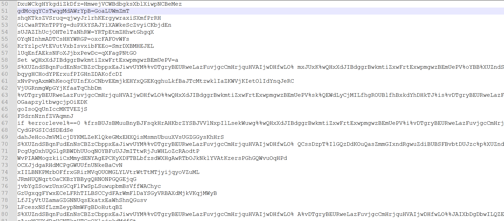
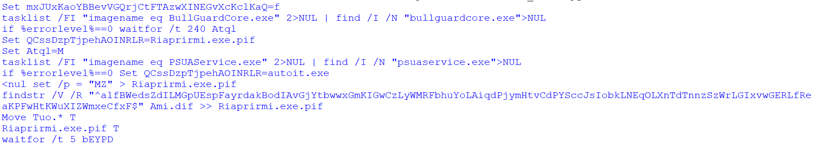

# env-deobfuscator
A handy tool I wrote to deobfuscate batch scripts that used environment variables obfuscation

# Real world example:
  #### Sample : sha256:c3c1549bdd5613e9dbc3f09963cd1bd0f303b6f33bb4df62d9260590869cadec

  This sample uses an obfuscated batch script to deobfuscate an AutoIt script and its interpreter.

  ### Before:
    

  ### After: You can clearly see the next stage
    
